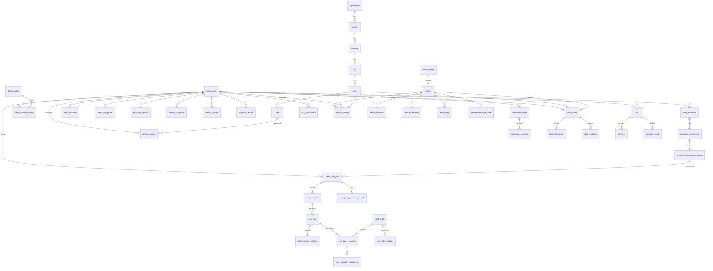

# 养老数字化平台数据库设计初稿

> 版本：v1.0 | 日期：2026-03-29 | 状态：数据库设计初稿（面向核心 5 大业务域）

---

## 目录

1. [文档目标](#1-文档目标)
2. [设计原则](#2-设计原则)
3. [数据库分层建议](#3-数据库分层建议)
4. [核心领域表清单](#4-核心领域表清单)
5. [核心关系图（Mermaid）](#5-核心关系图mermaid)
6. [关键表结构建议](#6-关键表结构建议)
7. [索引与分区建议](#7-索引与分区建议)
8. [事件与审计建议](#8-事件与审计建议)
9. [与当前工程的接口契约关系](#9-与当前工程的接口契约关系)
10. [DDL 初稿文件](#10-ddl-初稿文件)

---

## 1. 文档目标

本文档用于沉淀养老数字化平台的数据库初稿，优先覆盖五个核心业务域：

1. 老人域
2. 护理域
3. 健康域
4. 设备 / IoT 域
5. 报警域

同时补足这些域落地所必须依赖的基础支撑域：

- 组织与房间床位
- 用户与权限
- 通知与消息
- 财务账单
- 审计与事件

本文档的目标不是一次性穷举生产级全部字段，而是先形成：

- 稳定的领域主表
- 清晰的主外键关系
- 可用于后端 API 设计的对象边界
- 可用于当前 Admin 页面建模的统一数据口径

配套 SQL 初稿见：

- [POSTGRESQL_DDL_CORE.sql](./POSTGRESQL_DDL_CORE.sql)
- [TIMESCALEDB_TIMESERIES.sql](./TIMESCALEDB_TIMESERIES.sql)

---

## 2. 设计原则

### 2.1 主数据与事务数据分离

例如：

- `elder_profile` 是主数据
- `elder_admission`、`care_task_execution`、`alert_event` 是事务数据

### 2.2 时序数据与业务数据分离

例如：

- 血压、心率、睡眠、设备遥测不建议全部塞进业务主库宽表
- 健康与设备采样建议使用时序数据库承载

### 2.3 页面聚合不等于表设计

例如：

- Dashboard 页面会跨多个表聚合
- 老人详情页会同时读取老人主档、入住、护理计划、健康摘要、设备绑定等多个域

### 2.4 所有高风险动作必须可审计

包括：

- 护理补录
- 报警关闭
- 权限变更
- 账单调整
- AI 建议采纳或忽略

---

## 3. 数据库分层建议

| 层级 | 建议存储 | 建议技术 |
|------|----------|----------|
| 主数据层 | 老人、家属、员工、组织、房间、服务定义 | PostgreSQL |
| 事务层 | 入住、护理任务、报警流转、支付记录 | PostgreSQL |
| 时序层 | 健康指标、设备遥测、心跳记录 | TimescaleDB |
| 缓存层 | 会话、聚合缓存、告警热点数据 | Redis |
| 分析层 | 宽表、指标集市、训练样本 | 数据仓 / Lakehouse |

---

## 4. 核心领域表清单

### 4.1 基础组织与权限域

| 表名 | 说明 |
|------|------|
| `tenant` | 租户主体，面向 SaaS 多机构扩展 |
| `organization` | 机构主体 |
| `branch` | 分院 / 院区 |
| `building` | 楼栋 |
| `floor` | 楼层 |
| `room` | 房间 |
| `bed` | 床位 |
| `app_user` | 登录用户 |
| `role` | 角色定义 |
| `permission` | 权限项 |
| `user_role` | 用户角色关系 |
| `role_permission` | 角色权限关系 |
| `staff_profile` | 员工业务档案 |
| `family_profile` | 家属业务档案 |

### 4.2 老人域

| 表名 | 说明 |
|------|------|
| `elder_profile` | 老人主档案 |
| `elder_guardian_relation` | 老人与家属关系 |
| `elder_contact` | 紧急联系人 |
| `elder_tag` | 老人标签定义 |
| `elder_tag_relation` | 老人与标签关系 |
| `elder_admission` | 入住记录 |
| `admission_assessment` | 入住评估结构化记录 |
| `elder_discharge` | 离住 / 退住记录 |
| `bed_occupancy` | 床位占用关系 |
| `elder_face_profile` | 人脸档案 |
| `elder_visit_record` | 探视记录 |

### 4.3 护理域

| 表名 | 说明 |
|------|------|
| `care_level` | 护理等级定义 |
| `care_service_catalog` | 护理服务项定义 |
| `care_package` | 护理套餐 |
| `care_package_service` | 套餐与服务项关系 |
| `ai_care_level_recommendation` | AI 护理级别推荐结果 |
| `elder_care_plan` | 老人护理计划 |
| `care_plan_generation_record` | 护理计划生成记录 |
| `care_plan_item` | 护理计划项 |
| `care_task` | 系统生成任务 |
| `care_task_execution` | 任务执行记录 |
| `care_execution_attachment` | 执行附件，如图片、文件 |
| `care_shift_handover` | 交接班记录 |
| `task_reminder_schedule` | 护理任务提醒计划 |

### 4.4 健康域

| 表名 | 说明 |
|------|------|
| `health_metric_definition` | 健康指标定义 |
| `health_vital_record` | 生命体征采样记录 |
| `medical_record` | 医疗记录 |
| `diagnosis_record` | 诊断记录 |
| `medication_order` | 用药医嘱 |
| `medication_execution` | 用药执行记录 |
| `risk_assessment` | 风险评估 |
| `health_report_snapshot` | 健康报告快照 |

### 4.5 设备 / IoT 域

| 表名 | 说明 |
|------|------|
| `device_model` | 设备型号定义 |
| `device` | 设备主档 |
| `device_binding` | 设备与老人 / 房间绑定关系 |
| `device_telemetry` | 设备遥测时序数据 |
| `device_heartbeat` | 设备心跳 |
| `device_alert` | 设备异常事件 |
| `maintenance_work_order` | 维保工单 |
| `firmware_release` | 固件版本与发布记录 |

### 4.6 报警与消息域

| 表名 | 说明 |
|------|------|
| `alert_event` | 统一报警事件 |
| `alert_assignment` | 报警分派记录 |
| `alert_resolution` | 报警处理结论 |
| `notification_template` | 消息模板 |
| `notification_message` | 消息实例 |
| `notification_receipt` | 消息送达 / 已读回执 |

### 4.7 财务与审计域

| 表名 | 说明 |
|------|------|
| `billing_account` | 老人 / 家属结算账户 |
| `pricing_plan` | 定价策略 / 护理套餐价格 |
| `bill` | 账单主表 |
| `bill_item` | 账单明细 |
| `payment_record` | 支付记录 |
| `audit_log` | 审计日志 |
| `domain_event_outbox` | 领域事件 outbox |

---

## 5. 核心关系图（Mermaid）



---

## 6. 关键表结构建议

以下只列出首批最关键表的建议字段，用于后续 API 与 DTO 设计。

### 6.1 `elder_profile`

```sql
create table elder_profile (
  id uuid primary key,
  tenant_id uuid not null,
  organization_id uuid not null,
  elder_code varchar(64) not null unique,
  full_name varchar(128) not null,
  gender varchar(16) not null,
  birth_date date,
  id_card_masked varchar(64),
  phone varchar(32),
  care_level_id uuid,
  current_status varchar(32) not null,
  risk_level varchar(32),
  avatar_url text,
  remarks text,
  created_at timestamptz not null,
  updated_at timestamptz not null
);
```

用途：

- 老人列表页
- 老人详情页
- Dashboard 重点老人摘要
- 家属绑定与 AI 问答上下文入口

### 6.2 `elder_admission`

```sql
create table elder_admission (
  id uuid primary key,
  elder_id uuid not null,
  admission_no varchar(64) not null unique,
  admitted_at timestamptz not null,
  admitted_by uuid,
  room_id uuid,
  bed_id uuid,
  pricing_plan_id uuid,
  status varchar(32) not null,
  source varchar(32),
  notes text,
  created_at timestamptz not null,
  updated_at timestamptz not null
);
```

用途：

- 入住办理
- 床位占用
- 账单起算

### 6.2.1 `admission_assessment`

```sql
create table admission_assessment (
  id uuid primary key,
  admission_id uuid not null,
  elder_id uuid not null,
  assessment_source varchar(32) not null,
  adl_score numeric(10, 2),
  cognitive_level varchar(32),
  chronic_conditions jsonb,
  medication_summary jsonb,
  allergy_summary jsonb,
  risk_notes text,
  assessed_at timestamptz not null,
  assessed_by uuid,
  created_at timestamptz not null,
  updated_at timestamptz not null
);
```

用途：

- 承载入住登记后的结构化评估信息
- 作为 AI 护理级别推荐的标准输入
- 为后续人工复核、审计和模型迭代保留基准样本

### 6.2.2 `ai_care_level_recommendation`

```sql
create table ai_care_level_recommendation (
  id uuid primary key,
  assessment_id uuid not null,
  elder_id uuid not null,
  recommended_care_level_id uuid not null,
  confidence_score numeric(5, 2),
  reasoning_summary text,
  suggested_plan_template_code varchar(64),
  confirmation_status varchar(32) not null,
  confirmed_care_level_id uuid,
  confirmed_by uuid,
  confirmed_at timestamptz,
  created_at timestamptz not null,
  updated_at timestamptz not null
);
```

用途：

- 记录 AI 推荐护理级别与原因摘要
- 支持人工确认、调整与留痕
- 形成 AI 建议与人工最终决定的对照样本

### 6.3 `care_task`

```sql
create table care_task (
  id uuid primary key,
  elder_id uuid not null,
  plan_item_id uuid,
  organization_id uuid not null,
  task_type varchar(64) not null,
  task_title varchar(255) not null,
  priority varchar(32) not null,
  scheduled_at timestamptz not null,
  due_at timestamptz,
  assigned_staff_id uuid,
  status varchar(32) not null,
  source_type varchar(32) not null,
  source_ref_id uuid,
  created_at timestamptz not null,
  updated_at timestamptz not null
);
```

用途：

- 护理计划生成任务
- 员工任务中心
- AI 护理提醒
- 报警转任务

### 6.3.1 `care_plan_generation_record`

```sql
create table care_plan_generation_record (
  id uuid primary key,
  elder_id uuid not null,
  recommendation_id uuid,
  plan_id uuid not null,
  generation_source varchar(32) not null,
  template_code varchar(64),
  generated_by uuid,
  generated_at timestamptz not null,
  summary text,
  created_at timestamptz not null
);
```

用途：

- 记录护理计划由谁、何时、基于什么建议生成
- 让入住 AI 分级结果与后续护理计划建立可追溯关系

### 6.3.2 `task_reminder_schedule`

```sql
create table task_reminder_schedule (
  id uuid primary key,
  task_id uuid not null,
  reminder_channel varchar(32) not null,
  recipient_staff_id uuid not null,
  remind_at timestamptz not null,
  reminder_status varchar(32) not null,
  delivered_at timestamptz,
  created_at timestamptz not null,
  updated_at timestamptz not null
);
```

用途：

- 将护理任务拆成可执行提醒计划
- 与消息中心联动，到点通知护理人员执行护理项
- 为提醒送达率、超时率和执行率分析提供依据

### 6.4 `care_task_execution`

```sql
create table care_task_execution (
  id uuid primary key,
  task_id uuid not null,
  executed_by uuid not null,
  executed_at timestamptz not null,
  execution_status varchar(32) not null,
  duration_seconds integer,
  result_summary text,
  abnormal_flag boolean not null default false,
  abnormal_reason text,
  created_at timestamptz not null
);
```

用途：

- 服务打卡
- 补录与复核
- 质量统计

### 6.5 `health_vital_record`

```sql
create table health_vital_record (
  id uuid primary key,
  elder_id uuid not null,
  metric_code varchar(64) not null,
  metric_value_numeric numeric(12, 4),
  metric_value_text varchar(255),
  unit varchar(32),
  measured_at timestamptz not null,
  source_type varchar(32) not null,
  source_device_id uuid,
  source_staff_id uuid,
  risk_flag boolean not null default false,
  created_at timestamptz not null
);
```

用途：

- 健康总览
- 血压 / 心率 / 睡眠趋势
- 风险预测输入

### 6.6 `device`

```sql
create table device (
  id uuid primary key,
  tenant_id uuid not null,
  organization_id uuid not null,
  device_code varchar(64) not null unique,
  device_model_id uuid not null,
  device_type varchar(64) not null,
  status varchar(32) not null,
  online_status varchar(32) not null,
  battery_level integer,
  signal_strength integer,
  room_id uuid,
  purchased_at date,
  last_seen_at timestamptz,
  created_at timestamptz not null,
  updated_at timestamptz not null
);
```

用途：

- 设备总览
- 状态页
- 资产管理
- 维保工单入口

### 6.7 `device_telemetry`

```sql
create table device_telemetry (
  id uuid primary key,
  device_id uuid not null,
  metric_code varchar(64) not null,
  metric_value_numeric numeric(14, 4),
  metric_value_text varchar(255),
  payload jsonb,
  collected_at timestamptz not null
);
```

用途：

- 实时监控
- AI 异常检测
- 历史趋势回看

### 6.8 `alert_event`

```sql
create table alert_event (
  id uuid primary key,
  tenant_id uuid not null,
  organization_id uuid not null,
  alert_no varchar(64) not null unique,
  source_type varchar(32) not null,
  source_ref_id uuid,
  elder_id uuid,
  room_id uuid,
  device_id uuid,
  alert_type varchar(64) not null,
  alert_level varchar(32) not null,
  status varchar(32) not null,
  occurred_at timestamptz not null,
  acknowledged_at timestamptz,
  closed_at timestamptz,
  summary text,
  payload jsonb,
  created_at timestamptz not null
);
```

用途：

- 实时报警中心
- 报警历史
- 员工响应流转
- Analytics 复盘

---

## 7. 索引与分区建议

### 7.1 通用索引建议

以下表建议至少建立组合索引：

- `elder_profile(organization_id, current_status)`
- `care_task(assigned_staff_id, status, scheduled_at)`
- `care_task(elder_id, scheduled_at desc)`
- `alert_event(organization_id, status, occurred_at desc)`
- `device(organization_id, online_status, status)`

### 7.2 时序表分区建议

以下表建议按时间分区：

- `health_vital_record`
- `device_telemetry`
- `device_heartbeat`
- `notification_message`

建议粒度：

- 月分区适合中期规模
- 日分区适合高吞吐设备场景

### 7.3 高频查询建议

Dashboard 与列表页常见高频筛选：

- organization_id
- branch_id
- elder_id
- status
- occurred_at / measured_at / scheduled_at

这些字段应优先纳入索引策略。

---

## 8. 事件与审计建议

建议所有关键业务流采用事件驱动补强：

| 事件 | 来源表 | 消费方 |
|------|--------|--------|
| ElderAdmitted | `elder_admission` | Billing / Care / Notification |
| AdmissionAssessed | `admission_assessment` | AI / Care |
| CareLevelRecommendedByAI | `ai_care_level_recommendation` | Care / Admin |
| CareLevelConfirmed | `ai_care_level_recommendation` | Care / Notification |
| CareTaskGenerated | `care_task` | Staff / Notification / AI |
| CareReminderTriggered | `task_reminder_schedule` | Notification / Staff |
| VitalRecorded | `health_vital_record` | Alert / AI / Analytics |
| DeviceAbnormalDetected | `device_alert` | Alert / Device / Notification |
| AlertRaised | `alert_event` | Staff / Notification / AI |
| BillIssued | `bill` | Family App / Notification |

建议采用：

- `domain_event_outbox` 保障事件投递一致性
- `audit_log` 记录关键操作与前后值摘要

`audit_log` 建议至少记录：

- actor_user_id
- target_type
- target_id
- action
- before_snapshot
- after_snapshot
- request_id
- created_at

---

## 9. 与当前工程的接口契约关系

当前 Admin 页面与数据库域的大致关系如下：

| 页面模块 | 优先依赖表 |
|----------|------------|
| Dashboard | `elder_profile`, `care_task`, `alert_event`, `device`, `health_vital_record` |
| 入住办理 | `elder_admission`, `admission_assessment`, `ai_care_level_recommendation` |
| 老人详情 | `elder_profile`, `elder_admission`, `bed_occupancy`, `elder_guardian_relation`, `risk_assessment` |
| 护理任务中心 | `care_task`, `care_task_execution`, `care_shift_handover` |
| 健康总览 | `health_vital_record`, `risk_assessment`, `health_report_snapshot` |
| 设备总览 | `device`, `device_binding`, `device_alert`, `maintenance_work_order` |
| 报警中心 | `alert_event`, `alert_assignment`, `alert_resolution` |
| 账单中心 | `bill`, `bill_item`, `payment_record`, `pricing_plan` |

建议后续的 API 设计顺序：

1. 先围绕页面读模型输出 DTO
2. 再反推服务层 command / query
3. 最后再补齐写操作与审计字段

这样可以保证当前前端 Demo 平滑过渡到真实实现，而不是被底层表结构反向拖垮页面体验。

---

## 10. DDL 初稿文件

当前已补充首批 PostgreSQL 可执行 SQL 初稿：

- [POSTGRESQL_DDL_CORE.sql](./POSTGRESQL_DDL_CORE.sql)
- [TIMESCALEDB_TIMESERIES.sql](./TIMESCALEDB_TIMESERIES.sql)

该文件当前特点：

- 覆盖核心 20+ 张主表
- 包含主外键、唯一约束、关键索引与 `updated_at` 触发器
- 适合作为后端建模、迁移脚本拆分和 API DTO 设计起点

TimescaleDB 专用脚本当前特点：

- 将 `health_vital_record` 转为 hypertable
- 补充 `device_telemetry` 与 `device_heartbeat` 时序表
- 增加 continuous aggregate 示例与 retention policy 建议
- 适合作为健康趋势、设备趋势、AI 特征提取的时序层起点

当前未纳入首批 SQL 的内容：

- 全量权限项与 `permission` / `role_permission` 细表
- 通知模板与消息下发表
- 完整账单明细和定价规则表
- outbox / 事件总线的完整实现

建议后续拆分顺序：

1. 先把该 SQL 拆成 `base`、`elder`、`care`、`health`、`device`、`alert`、`billing` 七组 migration
2. 再补 TimescaleDB 专用脚本和 seed 数据
3. 最后补只读聚合视图与报表宽表脚本
